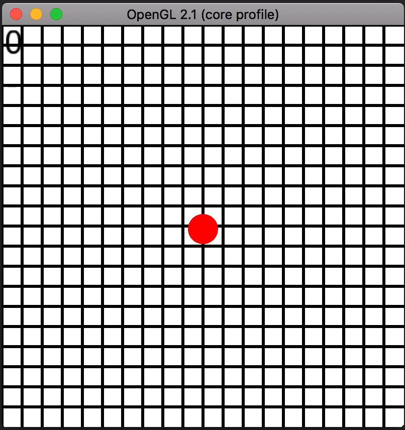

# RePacman

This is a Hackathon project from the [ReasonConf 2018](https://www.reason-conf.com/) in Vienna.

> 🚧 It's still a work in progress but it shows what you can build with Reprocessing and ReasonML ❤️



## Getting started

```bash
$ yarn
$ yarn build
$ yarn start # opens a OpenGL window
```

## Commands

* pressing ESC will reset the game
* pressing SPACE will pause the game
* arrow keyboards will move Pacman

## Contributing

Contributions are welcomed!

Check out the [Issues](https://github.com/reasonml-community/repacman/issues) to see who is working on what. In case something is not taken and you feel like working on that, feel free to assign the issue to yourself and give it a try!

We recommend opening an issue first before working on something, it makes it more transparent what's going on.
